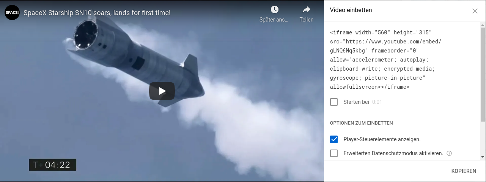
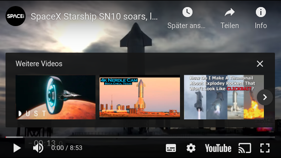
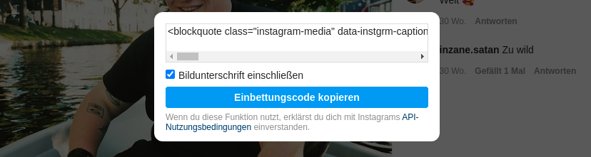
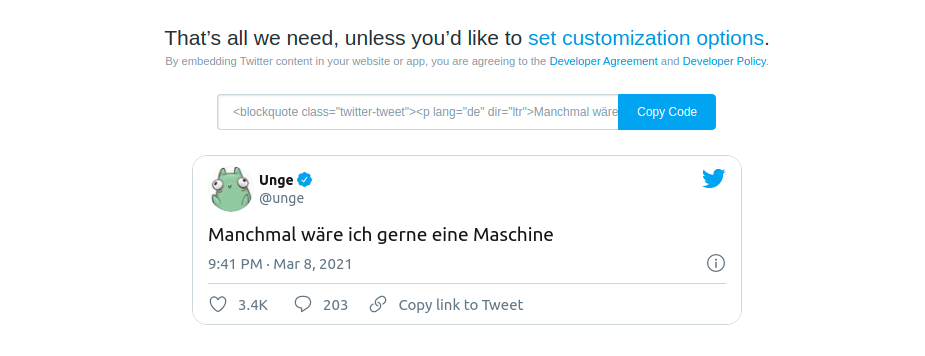
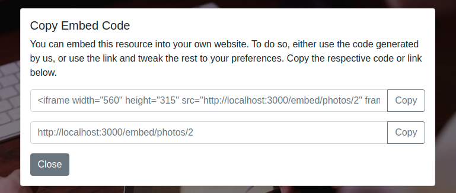

# EmbedMe
EmbedMe allows you and your users to easily embed your rails application or parts of it on other websites.


## Use Cases

### YouTube
YouTube has offered this feature for years. Users have the option to embed a video from YouTube on their own blog or website. While normal YouTube content (www.youtube.com/watch?v=) is blocked by the X-Frame options, content via a YouTube Embed URL (www.youtube.com/embed/...) can be displayed in a frame. If a video is opened in a frame, the appearance is optimized so that it works well in a frame (no ratings, no comments, only video). Although YouTube does not use this gem for this function, the way this gem works is adapted accordingly.






### Other Examples
Similar functions are also available on Twitter, Instagram, Google Maps and many other sites.






## Installation
Add this line to your application's Gemfile:

```ruby
gem 'embed_me'
```

And then execute:
```bash
$ bundle
```

Or install it yourself as:
```bash
$ gem install embed_me
```


## Usage

### Define Embeddable Routes

Define Resources that should be embeddable. The routes defined within the block are transferred to the application in duplicated form. Once normally, as they would always work, and once under an embed scope. The name of the scope can be set in config (default: 'embed'). All paths under the embed scope are sent without X-Frames-Options header, so they can be displayed in a frame. All other paths are sent normally (Rails default X-Frames-Options = SAMEORIGIN).

Assuming the following route definition:

```ruby
get 'private', to: 'application#private'
embeddable do
  get 'embeddable', to: 'application#embeddable'
end
```

Will produce following routes:

```
path_private     GET   /path_private(.:format)        application#path_private
path_embed       GET   /path_embed(.:format)          application#path_embed
embed_path_embed GET   /embed/path_embed(.:format)    application#path_embed {:embedded=>true}
```

To change the embed scope name, simply create a new initializer at `config/initializers/embed_me.rb` and put this content in it:

```ruby
EmbedMe.scope_name = :whatever
```

### Adjust Behaviour of Application

To customize the behavior of the application depending on the state of the embedding, you can use `embedded?`. This function returns true if the request was made via an embedding and false if it was a normal request.

In the following example, the Output is rendered with the default View at path `app/views/photos/show.html.erb`. However, if the request is embedded, a view at path `app/views/photos/embedded.html.erb` is rendered, which displays only the most important information (e.g. the photo in full screen).

```ruby
# GET /photos/1
def show
  @photo = Photo.find_by(id: params[:id])
  render "embedded" if embedded?
end
```

### Provide Embed-Code

You may want to show the user of your application the code to include the resource. There are several ways to accomplish this, depending on whether you want to define the code and appearance yourself. Use the following functions depending on your preference. Feel free to define the interface and the code completely yourself.

#### Default Frontend

To get the default interface, use the function `embed_frontend`, which returns an HTML button to open a basic pop-up that allows the user of the web page to copy the embedding code. The default design can be overridden with a file at `app/views/embed_me/_embed_frontend.html.erb`.

```html
<div class="container-fluid d-flex align-items-center">
  <!-- some frontend stuff -->
  <%= embed_frontend %>
</div>
```

Default Popup will look like this:



#### Default Embedding Code

If you want to implement the interface yourself, you can still use the default embedding code. Use the function `embed_code` for this, which generates some HTML code that allows embedding of the resource of the current request. Creates an iframe element with the embed link as src attribute. HTML options can be customized. Returns `nil` if the current page is not embeddable.

```ruby
embed_code()
# => "<iframe width="560" height="315" src="http://localhost:3000/embed" frameborder="0" sandbox="">Your Browser does not support HTML iFrame Element.</iframe>"

embed_code(fallback: "")
# => "<iframe width="560" height="315" src="http://localhost:3000/embed" frameborder="0" sandbox=""></iframe>"

embed_code(width: 760, height: 500)
# => "<iframe width="760" height="500" src="http://localhost:3000/embed" frameborder="0" sandbox="">Your Browser does not support HTML iFrame Element.</iframe>"

embed_code(width: nil, height: nil)
# => "<iframe src="http://localhost:3000/embed" frameborder="0" sandbox="">Your Browser does not support HTML iFrame Element.</iframe>"
```

### Adjust Links on embeddable Pages

If there is a link to a route within an embeddable page that is not available in an Embedding, the user will receive an error message "Refused to connect". You may want to check exactly which links must be present in an embeddable page. You can use the following link helpers for this purpose.

#### Embeddable Link To

Creates an HTML link element. To do this, it checks whether the request comes from an embedded resource and whether there is an embedded version of the requested route. If both are true, a link is generated that redirects to the embedded version. If no embedded version of the route exists, but the request is within an embedding, the link will be opened in a new tab. If the request is not embedded, the link is created as normal.

Assuming the current request is NOT embedded, then:

```ruby
embeddable_link_to("Not Embeddable", private_path)
# => <a href="/private">Not Embeddable</a>

embeddable_link_to("Embeddable", embeddable_path)
# => <a href="/embeddable">Embeddable</a>
```

Assuming the current request IS embedded, then:

```ruby
embeddable_link_to("Not Embeddable", private_path)
# => <a target="_blank" href="/private">Not Embeddable</a>

embeddable_link_to("Embeddable", embeddable_path)
# => <a href="/embed/embeddable">Embeddable</a>
```

#### Embedded Link Available?

Checks whether there is an embedded version of a specific route.

```ruby
embedded_link_available?(private_path)
# => false

embedded_link_available?(embeddable_path)
# => true
```

#### Current Page Embed URL

Checks if there is an embedded version for the current request. If this is the case, the link to the embedded version is returned. If there is no embedded version, nil is returned.

```ruby
# (request on embeddable_path)
current_page_embed_url()
# => http://localhost:3000/embed/embeddable

# (request on private_path)
current_page_embed_url()
# => nil
```


## License
The gem is available as open source under the terms of the [MIT License](https://opensource.org/licenses/MIT).
